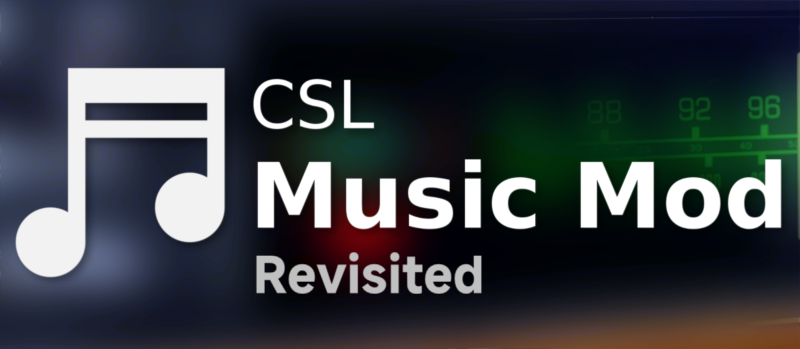

# Cities: Skylines
# CSL Music Mod Revisited

> This mod is an updated version for [CSL Music Mod](https://github.com/mrnotsoevil/CSLMusicMod) by mrnotsoevil.

## Please install the prerequisite [Harmony](https://github.com/boformer/CitiesHarmony/releases/latest) before using.

### Help with translation!

> For more information, please visit [Steam Workshop](https://steamcommunity.com/sharedfiles/filedetails/?id=3567203713). The mod can also be downloaded there.
